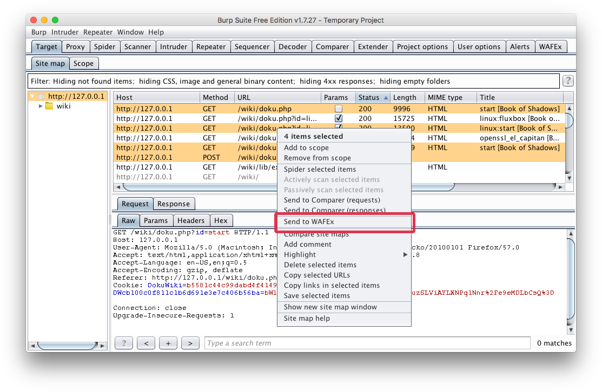
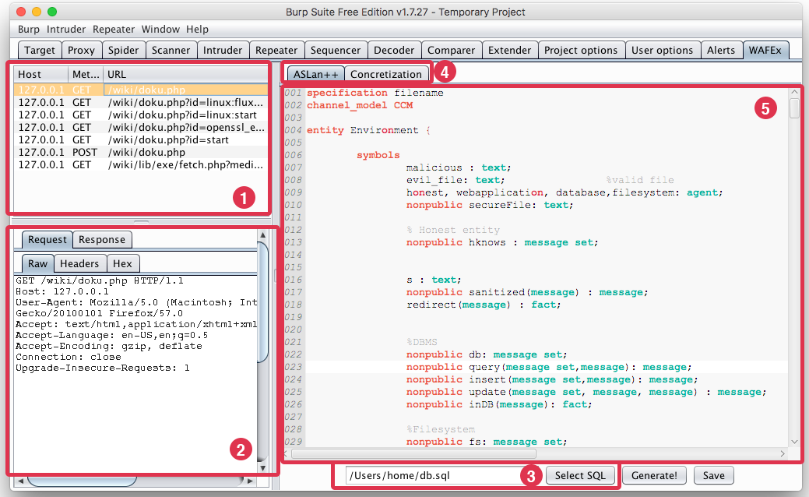

# WAFEx Model Creator

WAFEx Model Creator is an extension for Burp Proxy that allows for the simple extraction of a formal model in ASLan++ starting from a recorded HTTP sequence. WAFEx Model Creator can also be used to generate and edit the skeleton of an ASLan++ model and the concretization file.

## Requirements
* Java 1.7 or above
* Burp Suite (Community or Pro edition)
* [Jython 2.7.0](http://www.jython.org/downloads.html)
* [http-parser](https://github.com/benoitc/http-parser/)

## Installation
1. Clone the repository

    git clone https://github.com/rhaidiz/wafex-model-creator
2. Install `http-parser` (make sure you install it for Python2.7):

    pip install http-parser
3. Burp Suite -> Extender -> Options
	* Python Environment -> Location of Jython standalone JAR file: load jython standalone.
	* Python Environment -> Folder for loading mofules (optional): select the path of the Python libraries.
	* Java Environment -> Folder for loading library JAr files (optional): load richtextfx-fat-0.7-M5.java.
4. Burp Suite -> Extender -> Add
	* In Extension type select Python and load "wafex-model-creator.py"

# How to use

The security analyst interacts with the web application and records a sequence of HTTP requests\responses. He then selects the requests he wants to use for creating a model in ASLAn++ and, with left click, sends them to the WAFEx Model Creator plugin.

The user interface of WAFEx Model Creator provides: a table collecting the requests to translate (1), a panel showing details of a selected request (2), a file selector for specifying the database file (3), two tabs for ASLan++ and the concretization editors (4), and the actual editor that also provides syntax highlight (5).

